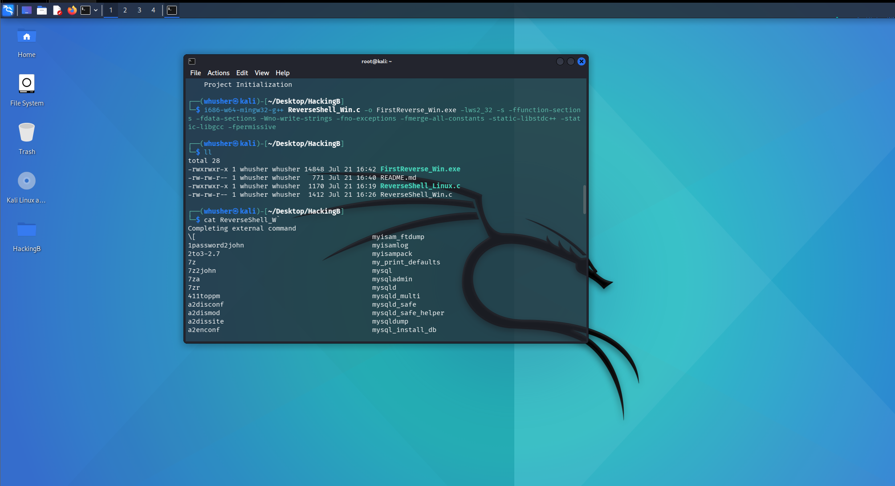

# 🔧 Cross-Platform Compilation Guide

> **Compiling Windows executables from Linux using MinGW-w64**

[](https://github.com)
[](https://mingw-w64.org)
[](LICENSE)

---

## 📋 Overview

When developing on Linux but targeting Windows systems, you'll need specialized cross-compilation tools. This guide walks you through setting up MinGW-w64 (Minimalist GNU for Windows) to compile Windows executables directly from your Linux environment.

## 🚀 Quick Start

### Prerequisites
- Ubuntu/Debian-based Linux system
- Administrator privileges (`sudo` access)
- Basic familiarity with command line

### Installation

#### Step 1: Update Package Repository
```bash
sudo apt update
```

#### Step 2: Install MinGW-w64 Compiler (32-bit)
```bash
sudo apt install g++-mingw-w64-i686
```

> 💡 **Tip**: Running as administrator ensures proper package installation and system-wide availability.

## 🔨 Compilation Process

### Basic Compilation Example
```bash
i686-w64-mingw32-g++ hack3.c -o hack3.exe -lws2_32 -s -ffunction-sections \
    -fdata-sections -Wno-write-strings -fno-exceptions -fmerge-all-constants \
    -static-libstdc++ -static-libgcc -fpermissive
```

### Compiler Flags Explained

| Flag | Purpose |
|------|---------|
| `-lws2_32` | Links Windows Socket library |
| `-s` | Strips debug symbols (smaller executable) |
| `-ffunction-sections` | Enables dead code elimination |
| `-fdata-sections` | Optimizes data sections |
| `-static-libstdc++` | Static linking of C++ standard library |
| `-static-libgcc` | Static linking of GCC runtime |

## 🎯 Architecture Support

### 64-bit Windows Targets

For modern 64-bit Windows systems, install the x86-64 compiler:

```bash
sudo apt install g++-mingw-w64-x86-64
```

**Verify installation:**
```bash
x86_64-w64-mingw32-g++ --version
```

### Architecture Compatibility Matrix

| Target | Compiler Package | Executable Compatibility |
|--------|------------------|--------------------------|
| 32-bit | `g++-mingw-w64-i686` | ✅ Windows 32-bit & 64-bit |
| 64-bit | `g++-mingw-w64-x86-64` | ✅ Windows 64-bit only |

> ⚠️ **Note**: 32-bit executables run on both 32-bit and 64-bit Windows systems, making them more universally compatible.

## 🔍 Verification & Troubleshooting

### Check Compiler Installation
```bash
# For 32-bit compiler
i686-w64-mingw32-g++ --version

# For 64-bit compiler  
x86_64-w64-mingw32-g++ --version
```

### Common Issues

<details>
<summary>🐛 <strong>Command not found error</strong></summary>

If you receive a "command not found" error:
1. Verify package installation: `dpkg -l | grep mingw`
2. Check PATH environment variable
3. Restart your terminal session

</details>

<details>
<summary>🔒 <strong>Permission denied</strong></summary>

Ensure you have proper write permissions in your target directory:
```bash
ls -la
chmod +w .
```

</details>


## Packaged Code



## 📚 Additional Resources

- [MinGW-w64 Official Documentation](https://www.mingw-w64.org/)
- [GCC Cross-Compilation Guide](https://gcc.gnu.org/onlinedocs/)
- [Windows API Reference](https://docs.microsoft.com/en-us/windows/win32/)

## 🤝 Contributing

Feel free to submit issues and enhancement requests!

---

<div align="center">

**Happy Cross-Compiling! 🎉**

*Made with ❤️ for the Linux → Windows development community*

</div>